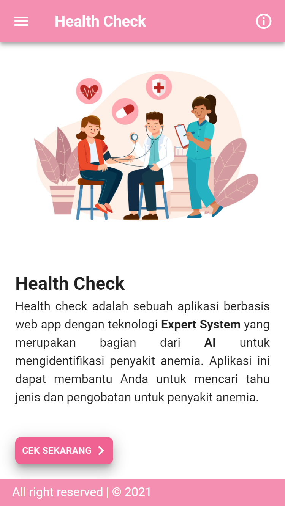

## Anemia Disease Identification Application, with Expert System

> Nuxt.js + PWA + Vuetify.js + Firebase starter project

## View
 <br/>


## Features

This starter project includes official Nuxt.js modules for best PWA project:

- [Http](https://github.com/nuxt/http)
- [PWA](https://github.com/nuxt-community/pwa-module)

It is also enriched with the best Vue's UI framework:

- [Vuetify](https://vuetifyjs.com)
- [VeeValidate](https://logaretm.github.io/vee-validate)

## Setup

```bash
# install dependencies
$ yarn # Or npm install

# serve with hot reload at localhost:3000
$ yarn dev

# build for production and launch server
$ yarn build
$ yarn start

# build for firebase and launch server
$ yarn build:firebase
$ yarn start:firebase

# generate static project
$ yarn generate

# Run unit test
$ yarn test

# Run e2e test
$ yarn dev
$ yarn test:e2e
```


## License

[MIT License](./license.md)

